  

  

 

---

## About

- 🎓 B.Tech **AI & Data Science** — India
- 🔭 Building **AI Systems** — LLMs, Agents, RAG pipelines
- 🧠 Researching **Context Engineering**, **Agent Memory**, **Efficient Inference**
- 🛠️ Production **Backend Engineering** — FastAPI, PostgreSQL, Docker
- 📬 **ajogdand375@gmail.com**

---

## Tech Stack

**AI / ML**

  

**Backend & Infrastructure**

  

**Languages & Tools**

  

---

## GitHub Stats

  
  

  

---

## Activity

  

---

## Trophies

  

---

## Projects

| Project | Description |
|---|---|
| Adaptive-Cognitive-Runtime | Self-tuning inference runtime that adapts context strategy per query |
| Production-RAG | Retrieval-augmented pipeline hardened for production traffic |
| APK-Reasoning-System | Static + LLM-assisted reasoning over Android APK behavior |
| Context-Compression | Long-context compression for cheaper, faster LLM calls |
| Knowledge-Graphs | Entity/relation extraction feeding graph-grounded retrieval |

---

## Research Interests

  
  
  
  
  
  

---

## Connect

  
  
  

  

